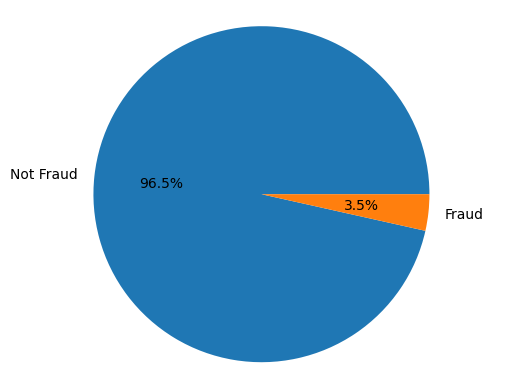
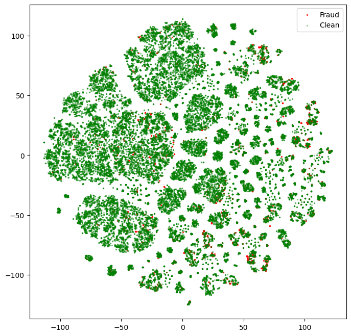

Phát hiện giao dịch gian lận từ giao dich trực tuyến

- Tập dữ liệu sử dụng được lấy từ cuộc thi Fraud Detection của IEEE: https://www.kaggle.com/competitions/ieee-fraud-detection

- Chúng tôi đã thử nghiệm các phương pháps để phát hiện giao dịch bất thường trong tập dữ liệu:
1. Auto-encoder (ANN)
2. Traditional machine learning based method: SVM
3. Voting based method: Random Forest
4. Cluster based method: Kmeans (Xác định số cụm tối ưu bằng phương pháp: Silhouette score)

Với Auto-encoder và Kmeans chúng tôi áp dụng phương pháp Robust Z-score để xác định ngưỡng bất thường từ sai số tính được. 

Tìm hiểu về dữ liệu: 

